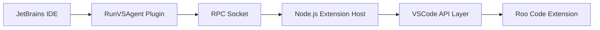

# Roo Code for JetBrains IDEs

This directory contains the integration of Roo Code with [RunVSAgent](https://github.com/wecode-ai/RunVSAgent), enabling Roo Code to run seamlessly in JetBrains IDEs (IntelliJ IDEA, WebStorm, PyCharm, etc.).

## 🎯 Overview

RunVSAgent acts as a bridge between VSCode extensions and JetBrains IDEs, allowing you to use Roo Code's AI-powered development features in your favorite JetBrains IDE.

## 🚀 Quick Start

### Prerequisites

- Node.js 18.0+
- JDK 17+
- JetBrains IDE 2023.1+
- Git

### Building

```bash
# From the project root
cd jetbrains
./build.sh
```

This will:

1. Update the RunVSAgent submodule
2. Build the Roo Code extension
3. Package everything for JetBrains
4. Create `dist/RunVSAgent-RooCode.zip`

### Installation

1. Open your JetBrains IDE
2. Go to **Settings/Preferences** → **Plugins**
3. Click the gear icon ⚙️ → **Install Plugin from Disk...**
4. Select `jetbrains/dist/RunVSAgent-RooCode.zip`
5. Restart your IDE

## 📁 Project Structure

```
jetbrains/
├── RunVSAgent/           # RunVSAgent submodule
│   ├── extension_host/   # Node.js runtime for VSCode APIs
│   ├── jetbrains_plugin/ # Kotlin-based JetBrains plugin
│   └── deps/
│       └── roo-code/    # Roo Code extension files
├── build.sh             # Main build script
├── build-dev.sh         # Development build (faster)
├── README.md            # This file
└── dist/                # Build output directory
```

## 🔧 Development

For development, use the faster dev build:

```bash
./build-dev.sh
```

This skips some optimization steps for quicker iteration.

### Debugging

1. **Extension Host Logs**: Check the IDE logs for Node.js runtime issues
2. **Plugin Logs**: Look in `Help → Show Log in Finder/Explorer`
3. **Enable Debug Mode**: Set `VSCODE_DEBUG=true` in environment

## 🏗️ Architecture



## 🤝 How It Works

1. **RunVSAgent Plugin** runs in the JetBrains IDE (Kotlin)
2. **Extension Host** provides VSCode-compatible APIs (Node.js)
3. **RPC Communication** bridges the two environments
4. **Roo Code** runs unmodified using VSCode APIs

## ⚙️ Configuration

After installation, configure Roo Code:

1. Open RunVSAgent panel in your IDE
2. Select "Roo Code" from available agents
3. Configure API keys and settings
4. Start using AI-powered development features

## 🐛 Troubleshooting

### Plugin doesn't load

- Ensure JetBrains IDE version ≥ 2023.1
- Check if JCEF is enabled (required for WebView)
- For Android Studio, [enable JCEF manually](https://github.com/wecode-ai/RunVSAgent/blob/main/docs/KNOWN_ISSUES.md#11-runtime-environment-does-not-support-jcef)

### Node.js not found

- Verify Node.js is in PATH: `node --version`
- Restart IDE after installing Node.js

### Extension not activating

- Check extension host logs
- Verify `deps/roo-code/` contains extension files
- Rebuild with `./build.sh`

## 📚 Resources

- [RunVSAgent Documentation](https://github.com/wecode-ai/RunVSAgent)
- [Roo Code Documentation](https://github.com/RooCodeInc/Roo-Code)
- [JetBrains Plugin Development](https://plugins.jetbrains.com/docs/intellij/welcome.html)

## 📄 License

This integration follows the licenses of both projects:

- Roo Code: [Check main repository](https://github.com/RooCodeInc/Roo-Code)
- RunVSAgent: Apache License 2.0
